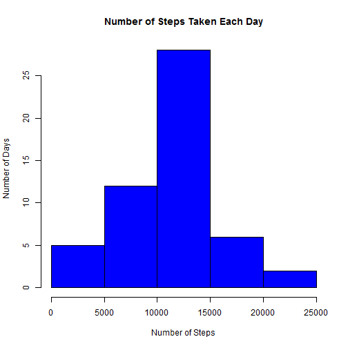
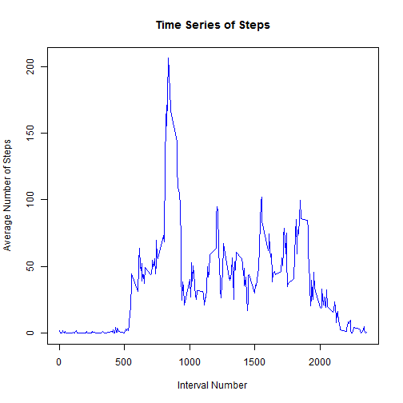
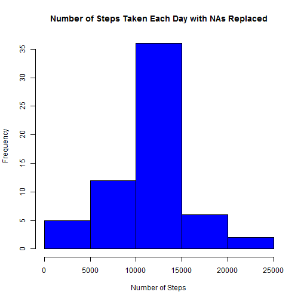
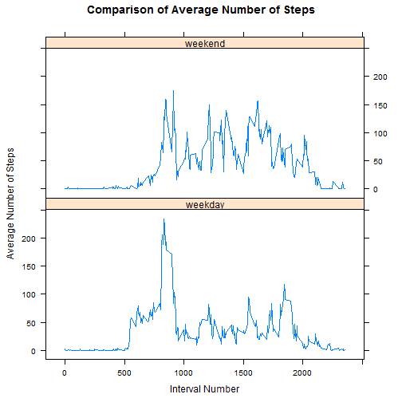

Reproducible Research: Peer Assessment 1
========================================================

## Introduction

It is now possible to collect a large amount of data about personal movement using activity monitoring devices such as a Fitbit, Nike Fuelband, or Jawbone Up. These type of devices are part of the "quantified self" movement - a group of enthusiasts who take measurements about themselves regularly to improve their health, to find patterns in their behavior, or because they are tech geeks. But these data remain under-utilized both because the raw data are hard to obtain and there is a lack of statistical methods and software for processing and interpreting the data.

This assignment makes use of data from a personal activity monitoring device. This device collects data at 5 minute intervals through out the day. The data consists of two months of data from an anonymous individual collected during the months of October and November, 2012 and include the number of steps taken in 5 minute intervals each day.

## Loading and preprocessing the data

First, we will download the data from the course web site and load it into R.


```r
setwd("C:/Users/lziegel1/Documents/CourseraDataScience/R/data/")
data = read.csv("activity.csv")
nd = names(data)
obs = nrow(data)
```


The variables included in this dataset are:
- **steps:** Number of steps taken in a 5-minute interval 
- **date:** The date on which the measurement was taken in YYYY-MM-DD format
- **interval:** Identifier for the 5-minute interval in which measurement was taken

The dataset is stored in a comma-separated-value (CSV) file and there are a total of 17568 observations in this dataset.

## What is mean total number of steps taken per day?

Next, we will analyze the number of steps taken per day.  First, we show a histogram of the total number of steps taken each day with the y-axis as frequency and the x-axis as the steps taken per day. Then, we compute the mean and median total number of steps taken per day, ignoring missing values in the dataset.  


```r

library(plyr)
StepsData = ddply(data, "date", summarise, totalsteps = sum(steps))
hist(StepsData$totalsteps, main = "Number of Steps Taken Each Day", xlab = "Number of Steps", 
    ylab = "Number of Days", col = "blue")
```

 

```r
MeanMS = mean(StepsData$totalsteps, na.rm = TRUE)
MedianMS = median(StepsData$totalsteps, na.rm = TRUE)
```


The mean number of daily steps is 1.0766 &times; 10<sup>4</sup> and the median is 10765.

## What is the average daily activity pattern?

The next activity that we will consider is analyzing daily activity patterns.  First, we will make a time series plot of the average number of steps taken across all day of each 5 minute interval, and then find the 5 minute interval that contains the maximum number of steps.


```r
StepInterval = ddply(data, "interval", summarize, meansteps = mean(steps, na.rm = TRUE))
plot(StepInterval$interval, StepInterval$meansteps, type = "l", main = "Time Series of Steps", 
    xlab = "Interval Number", ylab = "Average Number of Steps", col = "blue")
```

 

```r
MaxVal = max(StepInterval$meansteps)  #maximum number of steps
MaxInd = which.max(StepInterval$meansteps)  #index of max number of steps
MaxInt = data$interval[MaxInd]  #Interval corresponding to the maximum number of steps
```

The maximum number of steps across all days was 206.1698 which occured during the interval 835.


## Imputing missing values

There are a number of days/intervals where there are missing values (coded as NA). The presence of missing days may introduce bias into some calculations or summaries of the data.

```r
summary(data)
```

```
##      steps               date          interval   
##  Min.   :  0.0   2012-10-01:  288   Min.   :   0  
##  1st Qu.:  0.0   2012-10-02:  288   1st Qu.: 589  
##  Median :  0.0   2012-10-03:  288   Median :1178  
##  Mean   : 37.4   2012-10-04:  288   Mean   :1178  
##  3rd Qu.: 12.0   2012-10-05:  288   3rd Qu.:1766  
##  Max.   :806.0   2012-10-06:  288   Max.   :2355  
##  NA's   :2304    (Other)   :15840
```

```r
NumNA = sum(is.na(data$steps))
```

We see that only the steps variable is missing values withing our data set.  In fact, there are 2304 missing values within the data set, i.e. the total number of rows with NAs.

We will replace these missing values with the mean of the corresponding time interval.


```r
MergedData = merge(data, StepInterval)  #Merge the two data frames, so the mean number of steps corresponding to each interval is accessible
MergedData$steps[is.na(MergedData$steps)] = MergedData$meansteps[is.na(MergedData$steps)]
summary(MergedData)
```

```
##     interval        steps               date         meansteps     
##  Min.   :   0   Min.   :  0.0   2012-10-01:  288   Min.   :  0.00  
##  1st Qu.: 589   1st Qu.:  0.0   2012-10-02:  288   1st Qu.:  2.49  
##  Median :1178   Median :  0.0   2012-10-03:  288   Median : 34.11  
##  Mean   :1178   Mean   : 37.4   2012-10-04:  288   Mean   : 37.38  
##  3rd Qu.:1766   3rd Qu.: 27.0   2012-10-05:  288   3rd Qu.: 52.83  
##  Max.   :2355   Max.   :806.0   2012-10-06:  288   Max.   :206.17  
##                                 (Other)   :15840
```


Our new data set is called MergedData.

We will now make a histogram of the total number of steps taken each day as well as the mean and median total number of steps taken per day.


```r
MergedStepsData = ddply(MergedData, "date", summarise, totalsteps = sum(steps))
hist(MergedStepsData$totalsteps, main = "Number of Steps Taken Each Day with NAs Replaced", 
    xlab = "Number of Steps", ylab = "Frequency", col = "blue")
```

 

```r
MergedMeanMS = mean(MergedStepsData$totalsteps, na.rm = TRUE)
MergedMedianMS = median(MergedStepsData$totalsteps, na.rm = TRUE)
```


The mean number of daily steps is 1.0766 &times; 10<sup>4</sup> and the median is 1.0766 &times; 10<sup>4</sup>.  Note that the mean is precisely the same as our mean of the data without removing NA values.  This makes sense, because if we replace the missing values with the mean of the corresponding interval, then this will not change the mean.  The median is only slightly different.


## Are there differences in activity patterns between weekdays and weekends?

To analyze if there are difference in activity patterns between weekdays and weekends, we first need to determine which days actually are weekdays and which are weekend.


```r
Days = weekdays(as.Date(data$date))
data$DayofWeek = rep("weekday", nrow(data))
data$DayofWeek[Days == "Sunday" | Days == "Saturday"] = "weekend"
```


Now, let's compare the average number of steps taken over each 5-minut interval across all weekday days or weekend days.


```r
StepDays = ddply(data, c("interval", "DayofWeek"), summarize, meansteps = mean(steps, 
    na.rm = TRUE))
library(lattice)
xyplot(meansteps ~ interval | DayofWeek, data = StepDays, type = "l", layout = c(1, 
    2), ylab = "Average Number of Steps", xlab = "Interval Number", main = "Comparison of Average Number of Steps")
```

 

Notice that there appears to be a difference between activities during weekdays and weekends.  Over the course of the entire day the amount of walking seems to be more consistent on weekends than on weekdays, where there is a burst of activity in the morning, and then a small burst in the evening.  This may correspond to going and returning from work.

